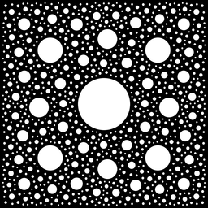
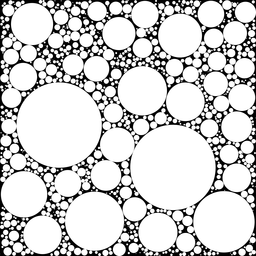

You can read this paper for introduction: 
[Paul Bourke - Random space filling of the plane (2011)](http://paulbourke.net/fractals/randomtile/).  
However, provided search algorithm for the next location is inefficient, 
and offers very limited control over the distribution.
In this work, i present a new solver over discrete signed distance field:   
  
Where **sdfn** are custom signed distance functions. Aggregate minima of which is stored in a bitmap. 
**cn+1** marks a point with highest value of the field, which then supplied to the next iteration
of the algorithm.

Currently, the solver is fully parallel, and highly generic.
Supported:
- Regular (fractal) distributions
- Random distributions
- Any shapes which can be represented with SDF: curves, regular polygons, non-convex polygons, disjoint areas
- Mixed shapes.

## Examples
You can run examples with following command:  
`cargo run --release --features "drawing" --example <example name> -- -C target-cpu=native`

[`examples/fractal_distribution`](examples/fractal_distribution.rs)  
Each subsequent circle is inserted at the maxima of distance field.  

[`examples/random_distribution`](examples/random_distribution.rs)  
Given `(xy, value)` of the maxima, a new random circle is inserted within a domain of radius `value` and center `xy`.     

[`examples/embedded`](examples/embedded.rs)   
A regular distribution embedded in a random one.
1. Insert a random distribution of circles;
1. Invert the distance field;
1. Insert a fractal distribution.

[`examples/image_dataset`](examples/image_dataset.rs)  
Display over 100'000 images.  
Run with `cargo run --release --features "drawing" --example image_dataset -- "<image folder>" -C target-cpu=native`  

## Past work
In `src/legacy` you can find numeruos algorithms which are worth re-exploring, including quadtree and GPU implementations. 

## Future work
- Add more sample SDFs, and generic draw trait
- Extend to discretization below 2-16 (gigapixel resolution)

Once above are done, I will use this library for my next project "Gallery of Babel".