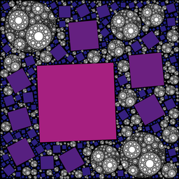
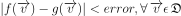
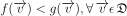

You can read this paper for introduction: 
[Paul Bourke - Random space filling of the plane (2011)](http://paulbourke.net/fractals/randomtile/).  
However, provided search algorithm for the next location is inefficient, 
and offers very limited control over the distribution.
In this work, i present a new solver over discrete signed distance field:   
  
Where **sdfn** are custom signed distance functions. Aggregate minima of which is stored in a bitmap. 
**cn+1** marks a point with highest value of the field, which then supplied to the next iteration
of the algorithm.

Currently, the solver is parallel, and highly generic.
Supported:
- Regular (fractal) distributions
- Random distributions
- Any shapes which can be represented with SDF: curves, regular polygons, 
  non-convex and disjoint areas, fractals or any sets with non-integer
  hausdorff dimension (as long as the distance can be approximated)

## Examples
You can run examples with following command:  
`cargo run --release --features "drawing" --example <example name> -- -C target-cpu=native`

[`examples/fractal_distribution`](examples/fractal_distribution.rs)  
Each subsequent circle is inserted at the maxima of distance field.  

[`examples/random_distribution`](examples/random_distribution.rs)  
Given `(xy, value)` of the maxima, a new random circle is inserted within a domain of radius `value` and center `xy`.     

[`examples/embedded`](examples/embedded.rs)   
A regular distribution embedded in a random one.
1. Insert a random distribution of circles;
1. Invert the distance field;
1. Insert a fractal distribution.

[`examples/polymorphic`](examples/polymorphic.rs)  
Showcasing:
- Dynamic dispatch interface;
- Random distribution of mixed shapes;
- Random color and texture fill style;
- Parallel generation and drawing.

[`examples/image_dataset`](examples/image_dataset.rs)  
Display over 100'000 images.  
Run with `cargo run --release --features "drawing" --example image_dataset -- "<image folder>" -C target-cpu=native`  

## Past work
In `src/legacy` you can find numeruos algorithms which are worth re-exploring, including quadtree and GPU implementations. 

## Future work
[x] Add more sample SDFs, and generic draw trait  
[x] Extend to support precision below 2-16 (gigapixel resolution)

A new algorithm is being developed in the separate branch, offering 10-100x memory reduction, as well as 
continuous field representation (as opposed to discrete).  
Based on the paper "Adaptively Sampled Distance Fields" (doi:[10.1145/344779.344899](http://dx.doi.org/10.1145/344779.344899)),
and my implementation of gradient descent with a custom convergence factor, as follows:
  
Where `D` is a control parameter, and `y` specifies the base exponential convergence rate.  
Further will be referenced as `GradientDescent<ADF>`, or to be more specific, 
`GradientDescent<Quadtree<Vec<Rc<dyn Fn(Point2D<f64>) -> f64>>>>`.  
Each node contains multiple signed distance functions. The actual value at a point is computed as 
minimum of all the functions. However, more theoretical research is required 
in order to speed up the algorithm. How to efficiently approximate following logical statements:
- 
- 

where `f` and `g` are arbitrary non-analytical functions.  
Additionally, in order to limit growth rate of the quadtree, 
it's possible to use "bin splitting" strategy.  
Alternatively, would storing polynomial approximations instead offer more advantages?  

Once above are done, I will use this library for my next project "Gallery of Babel".