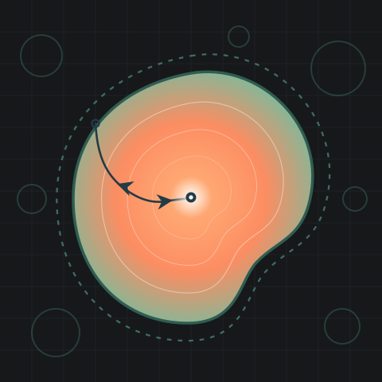
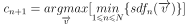
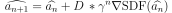
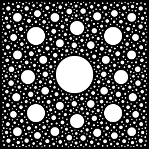
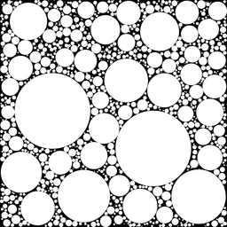
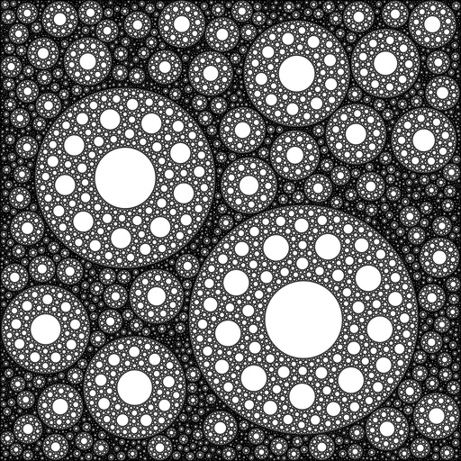
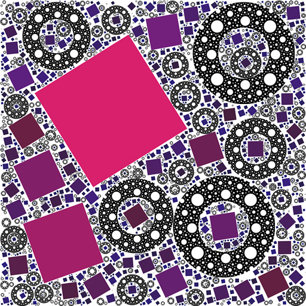
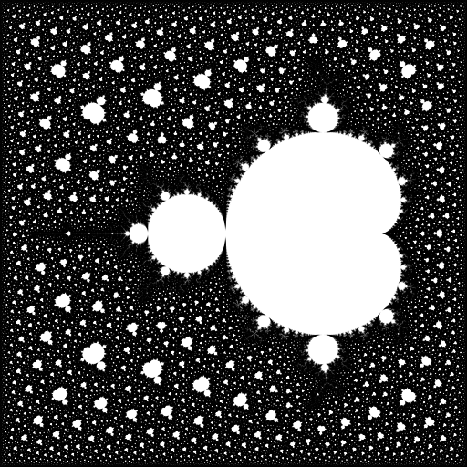

<div align="center">



# space-filling

*Generalized random space filling of the plane, driven by signed distance fields.*

[](https://crates.io/crates/space-filling)
[](https://docs.rs/space-filling)
[](./LICENCE)

</div>

> **Note.** This is a subject of ongoing research; no stability guarantees are made.

For an introduction, see [Paul Bourke — *Random space filling of the plane* (2011)](http://paulbourke.net/fractals/randomtile/).
There, however, the search for the next location is inefficient and offers very limited control over the
resulting distribution<sup>[[1]](#footnote_1)</sup>. This work presents two solvers for the following problem:



The **sdf<sub>n</sub>** are signed distance functions (*primitives*) whose aggregate pointwise minimum forms a
compound distance field, denoted **SDF** hereafter. The task is to locate a *safe domain* — a region guaranteed
not to intersect any shape — and to place the next primitive there. The interface is generic and parallel, and
supports:

- user-defined distributions (fractal, random, or otherwise);
- any shape expressible as an SDF: curves, regular polygons, non-convex and disjoint regions, and fractals or
  other sets of non-integer Hausdorff dimension (as long as the distance can be approximated).

### Argmax2D

The SDF is stored as a discrete bitmap whose memory layout follows a Z-order curve. The solver is guaranteed to
find the **global maximum**, but raising precision costs quadratic memory.

### GD-ADF

A paper *Adaptively Sampled Distance Fields* (doi:[10.1145/344779.344899](https://dl.acm.org/doi/10.1145/344779.344899))
proposes reducing memory by approximating the field per node of a k-d tree, yet gives little guidance for a
practical implementation beyond fitting a polynomial in each node. Current work takes a different route: each node
(*bucket*) stores the primitives themselves, and redundant primitives are eliminated from a bucket by a bounded
search over the node (see [Implementation](#implementation)). Because `ADF` itself implements the `SDF` trait, a
field composed of millions of primitives can be sampled in logarithmic time, rather than evaluated directly at
quadratic cost.

Once the representation is built, an optimizer takes over. For practical purposes we use gradient descent with
exponential step decay, which makes GD-ADF a **local-maximum** method:



Since a distance field has unit-magnitude gradient almost everywhere, only the *direction* of the gradient is
used — sidestepping several issues common to GD and interior-point methods, and freeing the step schedule from
any dependence on the field magnitude.

Relative to Argmax2D, GD-ADF offers a 10–100× memory reduction and a continuous, exact field, with several
speed/precision trade-offs, in both single and double precision.

## Implementation

Let a *primitive* be a pair `(f, L)` of a field `f` and a declared Lipschitz constant `L` (`L = 1` is exact for a
true SDF; approximate estimators declare a larger bound). A bucket `B = {(fᵢ, Lᵢ)}` represents the field
`g_B = min_i fᵢ`, which is `max_i Lᵢ`-Lipschitz.

#### `sdf_geq_everywhere(f, g, Ω, L_f, L_g, k) → bool`

Decides `f ≥ g` **everywhere on** the rectangle `Ω`. As `f`, `g` are Lipschitz, `f − g` is
`(L_f + L_g)`-Lipschitz, so over any rectangle `R` of centre `c` and half-diagonal `h(R)`:

```
∀ v ∈ R :  (f − g)(v)  ≥  (f − g)(c) − (L_f + L_g)·h(R)
```

This drives a branch-and-bound over a stack of rectangles, initialised with `Ω`, at depth `d`:

```
δ ← (f − g)(c_R)
  δ < 0                    ⟹  return false            ∃ witness v : f(v) < g(v)
  δ ≥ (L_f + L_g)·h(R)     ⟹  discard R                f ≥ g proven on all of R
  d ≥ k                    ⟹  return false            undecided within budget (conservative)
  otherwise                ⟹  push the 4 quadrants of R at depth d+1
stack empties              ⟹  return true             f ≥ g on Ω
```

The test is **sound**: it returns `true` only when `f ≥ g` holds on all of `Ω`, never the converse — so it can
be trusted to drop or skip a primitive without corrupting the field. It is *conservative*: it may answer `false`
when it cannot prove the bound within `k` refinements. Cost is adaptive — well-separated fields settle at the
root, and a real witness is reached by descent rather than by a fixed grid.

#### `insert_primitive_domain(Ω, (f, L_f)) → bool`

Inserts `f` over the domain `Ω`. Every leaf `n` (rectangle `Rₙ`, bucket `Bₙ`) meeting `Ω` is refined
independently and in parallel, with `β` the bucket size and `D` the maximum depth:

```
f ≥ g_Bₙ  on Rₙ                   ⟹  no-op            f never lowers the field on Rₙ
g_Bₙ ≥ f  on Rₙ                   ⟹  Bₙ ← {f}         f dominates the node
depth(n) = D  ∨  |Bₙ| < β         ⟹  Bₙ ← Bₙ ∪ {f}   append
otherwise                         ⟹  subdivide n;  B_c ← prune(Bₙ ∪ {f}, R_c)  for each child c
```
```
prune(B, R)  =  { (fᵢ, Lᵢ) ∈ B  :  ¬ ( fᵢ ≥ min_{j ≠ i} fⱼ  on R ) }
```

Every `≥ on R` predicate is decided by `sdf_geq_everywhere`. Consequently a primitive is skipped or eliminated
only when *provably* redundant on the node: the stored field never deviates from `min` over all inserted
primitives (pruning errs toward keeping, never toward corrupting). The return value reports whether the tree
changed.

#### Insertion domains

An insertion at a maximum `x₀` with `d = g(x₀)` places `S ⊆ B̄(x₀, d)`, hence `f(v) ≥ |v − x₀| − d`, and the
field can change only inside

```
D* = { v : g(v) > |v − x₀| − d }
```

— a tight bound: every `v ∈ D*` is reached by some admissible `S`. Two regimes follow:

- `x₀` a **global** maximum: `g ≤ d` everywhere gives `D* ⊆ B(x₀, 2d)`, whose minimal axis-aligned cover is
  the square of side `4d`, attained by two tangent maximal balls (`util::domain_global_max`). The historical
  side of `4·√2·d` was sound here, but twice oversized in area.
- `x₀` a **local** maximum: *no* square of side `c·d` is sound, for any constant `c`. Three contact points
  with angular gaps `< π` admit an escape ray `w` along which `g(x₀ + R·w) = √(R² − 2Rd·cos(γ/2) + d²) > R − d`
  for every `R` — the update region is unbounded in units of `d`
  (`solver::adf::tests::insertion_domain` constructs a concrete field corruption for the `4·√2` rule).
  `ADF::insert_at_maximum` therefore prunes during the tree walk itself, discarding a subtree `R` once

  ```
  ĝ(c_R) + L_B·h(R)  ≤  dist(R, x₀) − d,
  ```

  where `ĝ` is the node's own bucket field — exact at leaves, and at internal nodes a pre-subdivision
  snapshot, a valid upper bound of `g` since insertions only ever lower the field.

## Examples

Run an example with:

```
cargo run --release --features "drawing" --example <example name>
```

Append `-- -C target-cpu=native` to improve throughput further.

[`01_fractal_distribution`](examples/argmax2d/01_fractal_distribution.rs)  
Each successive circle is placed at the maximum of the distance field.  


[`02_random_distribution`](examples/gd_adf/02_random_distribution.rs)  
Given a maximum `(xy, magnitude)`, a random circle is inserted within the disc of radius `magnitude` centred at `xy`.  


[`03_embedded`](examples/argmax2d/03_embedded.rs)  
A distribution embedded within a distribution.  


[`04_polymorphic`](examples/gd_adf/04_polymorphic.rs)  
Showcasing:
- a dynamic-dispatch interface;
- a random distribution of mixed shapes;
- random colour and texture fill styles;
- parallel generation and drawing.



[`05_image_dataset`](examples/argmax2d/05_image_dataset.rs)  
Displays over 100 000 images.  
Run with `cargo run --release --features "drawing" --example 05_image_dataset -- "<image folder>" -C target-cpu=native`


[`06_custom_primitive`](examples/gd_adf/06_custom_primitive.rs)  
A user-defined primitive — here a Mandelbrot distance estimator, which is *not* 1-Lipschitz and so declares a
larger Lipschitz bound to keep pruning sound.  


[`07_baked_sdf`](examples/gd_adf/07_baked_sdf.rs)  
Bakes that same fractal estimator into a discrete field once — rasterize a mask, take its exact signed Euclidean
distance transform, then sample bilinearly. This replaces a 256-iteration evaluation with a single lookup and
recovers a *certified* Lipschitz bound (`1 + √2`), at the cost of detail below the grid pitch.

## Past work

`src/legacy` holds several algorithms worth revisiting, including quadtree and GPU implementations.

## Future work

- [x] Add more sample SDFs, and a generic draw trait
- [x] Extend precision below 2<sup>-16</sup> (gigapixel resolution)
- [x] Rework the traits
- [ ] Generalize to N dimensions

Once above are done, I will use this library for my next project "Gallery of Babel".

#### Footnotes

<a id="footnote_1">[1]</a>: J. Shier, "A Million-Circle Fractal": [https://www.d.umn.edu/~ddunham/circlepat.html](https://www.d.umn.edu/~ddunham/circlepat.html)
&laquo;...Run time was 14.7 hours.&raquo;
