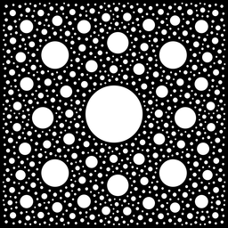
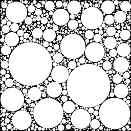
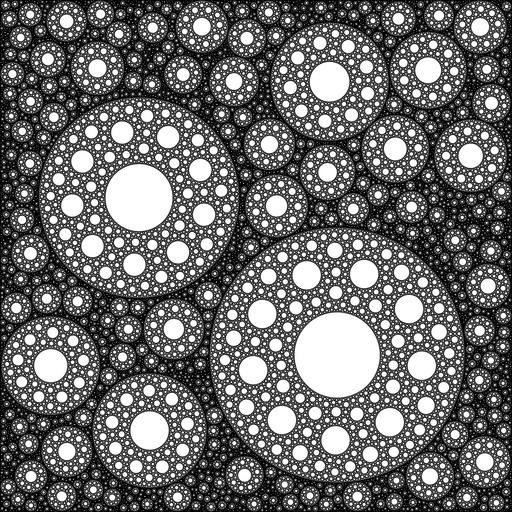
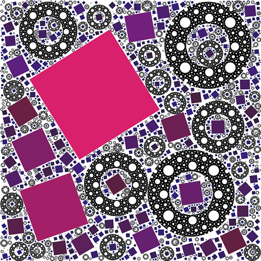
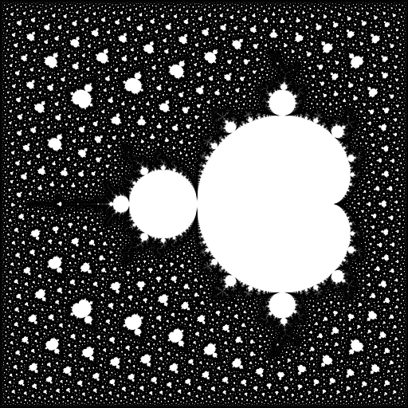

<div align="center">

*«The dreams of a builder drunk on pure volumes, pure space.»*

[](https://crates.io/crates/space-filling)
[](https://docs.rs/space-filling)
[](./LICENCE)

</div>

> **Note.** This is a subject of ongoing research; no stability guarantees are made.

For an introduction, see [Paul Bourke — *Random space filling of the plane* (2011)](http://paulbourke.net/fractals/randomtile/).
There, however, the search for the next location is inefficient and offers very limited control over the
resulting distribution<sup>[[1]](#footnote_1)</sup>. This work presents two solvers for the following problem:

$$\vec{x}^{*} = \arg\max_{\vec v \in \Omega}\ \min_{n}\ \mathrm{sdf}_{n}(\vec v)$$

The **sdf<sub>n</sub>** are signed distance functions (*primitives*) whose aggregate pointwise minimum forms a
compound distance field, denoted **SDF** hereafter. The task is to locate a *safe domain* — a region guaranteed
not to intersect any shape — and to place the next primitive there. The interface is generic and parallel, and
supports:

- user-defined distributions (fractal, random, or otherwise);
- any shape expressible as an SDF: curves, regular polygons, non-convex and disjoint regions, and fractals or
  other sets of non-integer Hausdorff dimension (as long as the distance can be approximated).

### Argmax2D

The SDF is stored as a discrete bitmap whose memory layout follows a Z-order curve. The solver is guaranteed to
find the **global maximum**, but raising precision costs quadratic memory.

### GD-ADF

A paper *Adaptively Sampled Distance Fields* (doi:[10.1145/344779.344899](https://dl.acm.org/doi/10.1145/344779.344899))
proposes reducing memory by approximating the field per node of a k-d tree, yet gives little guidance for a
practical implementation beyond fitting a polynomial in each node. Current work takes a different route: each node
(*bucket*) stores the primitives themselves, and redundant primitives are eliminated from a bucket by a bounded
search over the node (see [Implementation](#implementation)). Because `ADF` itself implements the `SDF` trait, a
field composed of millions of primitives can be sampled in logarithmic time, rather than evaluated directly at
quadratic cost.

Once the representation is built, an optimizer takes over — an adaptive gradient ascent, which makes GD-ADF a
**local-maximum** method. 
<details>
<summary>Details</summary>
A candidate step of length `h` along the sampled ascent direction is taken only when it
improves the field, so the iterate is monotone; `h` grows on acceptance and shrinks on rejection, and the previous
accepted direction is blended into the next (momentum), cancelling the across-ridge zigzag at the kink maxima of
distance fields (which lie on the medial axis, where `g` is not differentiable):

```
d_k     =  normalize( ∇g(p_k)/|∇g(p_k)| + d_{k-1} )
p_{k+1} =  p_k + h_k·d_k        if g improves, else p_k;      h ← h·growth | h·decay
```
</details><br>

Since a distance field has unit-magnitude gradient almost everywhere, only the *direction* of the gradient is
used — sidestepping several issues common to GD and interior-point methods, and freeing the step schedule from
any dependence on the field magnitude. A vanishing sampled gradient (a flat region, e.g. the clamped interior of
a distance estimator) terminates the ascent immediately rather than wasting the iteration budget.

Relative to Argmax2D, GD-ADF offers a 10–100× memory reduction and a continuous, exact field, with several
speed/precision trade-offs, in both single and double precision.

## Implementation
Let a *primitive* be a pair `(f, L)` of a field `f` and a declared Lipschitz constant `L` (`L = 1` is exact for a
true SDF; approximate estimators declare a larger bound). A bucket `B = {(fᵢ, Lᵢ)}` represents the field
`g_B = min_i fᵢ`, which is `max_i Lᵢ`-Lipschitz. Shape types declare their bound through the `Lipschitz` trait —
built-in shapes return `1`, estimators their own constant, and combinators propagate the maximum over their
operands — so `Primitive::from_shape` derives `L` automatically.

#### `sdf_geq_everywhere(f, g, Ω, L_f, L_g, k) → bool`

Decides `f ≥ g` **everywhere on** the rectangle `Ω`. As `f`, `g` are Lipschitz, `f − g` is
`(L_f + L_g)`-Lipschitz, so over any rectangle `R` of centre `c` and half-diagonal `h(R)`:

```
∀ v ∈ R :  (f − g)(v)  ≥  (f − g)(c) − (L_f + L_g)·h(R)
```

This drives a branch-and-bound over a stack of rectangles, initialised with `Ω`, at depth `d`:

```
δ ← (f − g)(c_R)
  δ < 0                    ⟹  return false            ∃ witness v : f(v) < g(v)
  δ ≥ (L_f + L_g)·h(R)     ⟹  discard R                f ≥ g proven on all of R
  d ≥ k                    ⟹  return false            undecided within budget (conservative)
  otherwise                ⟹  push the 4 quadrants of R at depth d+1
stack empties              ⟹  return true             f ≥ g on Ω
```

The test is **sound**: it returns `true` only when `f ≥ g` holds on all of `Ω`, never the converse — so it can
be trusted to drop or skip a primitive without corrupting the field. It is *conservative*: it may answer `false`
when it cannot prove the bound within `k` refinements. Cost is adaptive — well-separated fields settle at the
root, and a real witness is reached by descent rather than by a fixed grid.

#### `insert_primitive_domain(Ω, (f, L_f)) → bool`

Inserts `f` over the domain `Ω`. Every leaf `n` (rectangle `Rₙ`, bucket `Bₙ`) meeting `Ω` is refined
independently and in parallel, with `β` the bucket size and `D` the maximum depth:

```
f ≥ g_Bₙ  on Rₙ                   ⟹  no-op            f never lowers the field on Rₙ
g_Bₙ ≥ f  on Rₙ                   ⟹  Bₙ ← {f}         f dominates the node
depth(n) = D  ∨  |Bₙ| < β         ⟹  Bₙ ← Bₙ ∪ {f}   append
otherwise                         ⟹  subdivide n;  B_c ← prune(Bₙ ∪ {f}, R_c)  for each child c
```
```
prune(B, R)  =  { (fᵢ, Lᵢ) ∈ B  :  ¬ ( fᵢ ≥ min_{j ≠ i} fⱼ  on R ) }
```

Every `≥ on R` predicate is decided by `sdf_geq_everywhere`. Consequently a primitive is skipped or eliminated
only when *provably* redundant on the node: the stored field never deviates from `min` over all inserted
primitives (pruning errs toward keeping, never toward corrupting). The return value reports whether the tree
changed.

#### Insertion domains

An insertion at a maximum `x₀` with `d = g(x₀)` places `S ⊆ B̄(x₀, d)`, hence `f(v) ≥ |v − x₀| − d`, and the
field can change only inside

```
D* = { v : g(v) > |v − x₀| − d }
```

— a tight bound: every `v ∈ D*` is reached by some admissible `S`. Two regimes follow:

- `x₀` a **global** maximum: `g ≤ d` everywhere gives `D* ⊆ B(x₀, 2d)`, whose minimal axis-aligned cover is
  the square of side `4d`, attained by two tangent maximal balls (`util::domain_global_max`). The historical
  side of `4·√2·d` was sound here, but twice oversized in area.
- `x₀` a **local** maximum: *no* square of side `c·d` is sound, for any constant `c`. Three contact points
  with angular gaps `< π` admit an escape ray `w` along which `g(x₀ + R·w) = √(R² − 2Rd·cos(γ/2) + d²) > R − d`
  for every `R` — the update region is unbounded in units of `d`
  (`solver::adf::tests::insertion_domain` constructs a concrete field corruption for the `4·√2` rule).
  `ADF::insert_at_maximum` therefore prunes during the tree walk itself, discarding a subtree `R` once

  ```
  ĝ(c_R) + L_B·h(R)  ≤  dist(R, x₀) − d,
  ```

  where `ĝ` is the node's own bucket field — exact at leaves, and at internal nodes a pre-subdivision
  snapshot, a valid upper bound of `g` since insertions only ever lower the field.

## Higher D

The tree's subdivision layout is a compile-time parameter.

- [`Orthant`](adaptive-distance-field/src/adf/tree.rs) halves every axis at once, `2^D` children per node. It
  exists for `D = 1..=6` only. It wins **queries** at every dimension it
  supports, by 1.5–1.9×, its descent being `D` times shallower.
- [`Kd`](adaptive-distance-field/src/adf/tree.rs) halves one axis per level, 2 children per
  node. Carries no ceiling, and its **build** advantage grows with dimension: ×0.94 at `D = 3`, ×0.46 at
  `D = 6`. One subdivision allocates 2 nodes rather than `2^D` — or a million per split at `D = 20`.

So `Orthant` for query-heavy work in two or three dimensions, `Kd` above three and necessarily above six. The
depth budget counts *full* subdivisions in either layout, which for `Kd` is `D` levels; since the arena stores
depth in a `u8`, the mechanical ceiling is `max_depth × D ≤ 255`. Measured to `D = 20`.

#### What dimension does to the proof

Every certificate rests on the cell's **half-diagonal** `h(R)`, which on the unit cube is `√D/2` — that is `√D`
times its half-side, so a cell is `√D` harder to certify than the same cell in one dimension. Two consequences,
and neither is optional above `D ≈ 6`:

- The branch-and-bound descends toward its budget instead of returning early, and that budget is
  `prune_subdiv × D` levels under `Kd`. The default of `8` is a two-dimensional default: a *single* insertion
  measures 6.1 s at `D = 8` and 4.4 s at `D = 10`, against 3 ms at `D = 20` with
  [`with_prune_subdiv(1)`](adaptive-distance-field/src/adf/mod.rs).
- From `D ≈ 4` a one-axis cut prunes nothing whatever — a ball straddling it survives on both sides, so both
  children inherit the parent's whole bucket and both overflow again on the next insertion. Left alone the tree
  **doubles on every insertion**: the `D ≥ 13` arenas came out as exact `2^k − 1` complete binary trees, every
  leaf holding every primitive, 300 MiB for twenty balls.

Therefore pruning is *not* disabled, and never becomes unsound — it is still attempted on every trial cell, and still only
ever drops a primitive it has proved redundant. What is refused is the **subdivision** that would buy nothing,
from `CUT_MUST_PRUNE_MIN_DIMS = 4` upward, which collapses a k-d field to a single fat leaf answering queries
with exactly the primitives the deep tree would have held. Worth ×3.9 to ×75 the circles placed and 1450–12600×
less memory. The threshold is where the covering overhead of a box against the ball its own certificate can
actually cover, `(√D/2)^D = (D/4)^(D/2)`, passes 1 — which is exactly `D = 4`. Query-heavy work in `4..10` can
have the deep tree back with [`with_cut_must_prune(false)`](adaptive-distance-field/src/adf/mod.rs): at `D = 6`
that is build ×5.0 slower, query ×2.96 faster, memory ×620 larger.

For why the `√D` is intrinsic to boxes rather than to Lipschitz certification, and what a ball-based hierarchical
cover would change, see [§2.2 *Where the certificate breaks, exactly*](doc/publications/infinite_dimensions/readme.md#22-where-the-certificate-breaks-exactly)
and [§6.6](doc/publications/infinite_dimensions/readme.md#66-metric-space-adf-the-structural-generalization).

#### Constructing one

```rust
// Three dimensions, all axes at once: the fastest queries, and the historical layout.
let octree = ADF::<f64, 3, Orthant>::new(6, vec![Primitive::new(sdf::boundary_rect)]);

// Twenty dimensions, one axis per level — 2 full subdivisions, so 40 k-d levels.
// Above D ≈ 6 the proof budget has to come down, or one insertion takes seconds.
let wide = ADF::<f64, 20, Kd>::new(2, vec![Primitive::new(sdf::boundary_rect)])
  .with_prune_subdiv(1);

// Or pin one parameter at a time, in any order; `bounded` seeds the domain walls for you.
let field = adf::builder().f64().dims::<6>().kd().prune_subdiv(1).bounded(3);

// Keep the deep tree in a middling dimension, paying build to save query.
let deep = ADF::<f64, 6, Kd>::new(2, vec![Primitive::new(sdf::boundary_rect)])
  .with_cut_must_prune(false);
```

## Examples

Run an example with:

```
cargo run --release --features "drawing" --example <example name>
```

Append `-- -C target-cpu=native` to improve throughput further.

[`01_fractal_distribution`](examples/argmax2d/01_fractal_distribution.rs)  
Each successive circle is placed at the maximum of the distance field.  


[`02_random_distribution`](examples/gd_adf/02_random_distribution.rs)  
Given a maximum `(xy, magnitude)`, a random circle is inserted within the disc of radius `magnitude` centred at `xy`.  


[`03_embedded`](examples/argmax2d/03_embedded.rs)  
A distribution embedded within a distribution.  


[`04_polymorphic`](examples/gd_adf/04_polymorphic.rs)  
Showcasing:
- a dynamic-dispatch interface;
- a random distribution of mixed shapes;
- random colour and texture fill styles;
- parallel generation and drawing.



[`05_image_dataset`](examples/argmax2d/05_image_dataset.rs)  
Displays over 100 000 images.  
Run with `cargo run --release --features "drawing" --example 05_image_dataset -- "<image folder>" -C target-cpu=native`


[`06_custom_primitive`](examples/gd_adf/06_custom_primitive.rs)  
A user-defined primitive — here a Mandelbrot distance estimator, which is *not* 1-Lipschitz and so declares a
larger Lipschitz bound to keep pruning sound.  


[`07_baked_sdf`](examples/gd_adf/07_baked_sdf.rs)  
Bakes that same fractal estimator into a discrete field once — rasterize a mask, take its exact signed Euclidean
distance transform, then sample bilinearly. This replaces a 256-iteration evaluation with a single lookup and
recovers a *certified* Lipschitz bound (`1 + √2`), at the cost of detail below the grid pitch.  

[`08_embedded_3d`](doc/video2/src/08_embedded_3d.rs)  
Same as 03_embedded, but in ℝ³ using GD-ADF solver.  


## Past work

`src/legacy` holds several algorithms not worth revisiting, including quadtree and GPU implementations.

## Future work

- [x] Add more sample SDFs, and a generic draw trait
- [x] Extend precision below 2<sup>-16</sup> (gigapixel resolution)
- [x] Rework the traits
- [x] Generalize to N dimensions
- [ ] Generalize to [infinite-dimensional](doc/publications/infinite_dimensions) function and $\mathbb{R}^N \rtimes SO(N)$ configuration spaces

Once above are done, I will use this library for my next project "Gallery of Babel".

#### Footnotes

<a id="footnote_1">[1]</a>: J. Shier, "A Million-Circle Fractal": [https://www.d.umn.edu/~ddunham/circlepat.html](https://www.d.umn.edu/~ddunham/circlepat.html)
&laquo;...Run time was 14.7 hours.&raquo;
